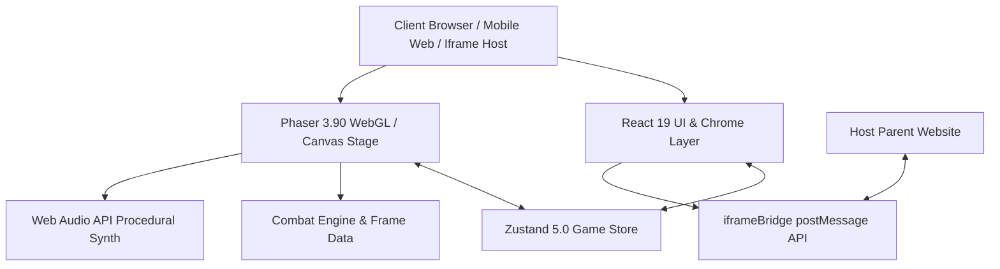
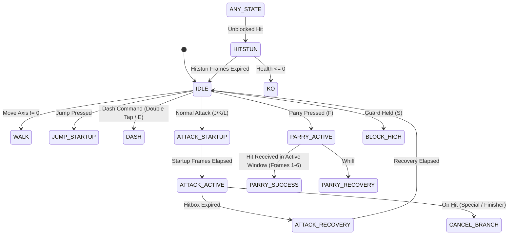

# South Florida Fighter — Full Technical Specification & Architecture Manual

This document provides a comprehensive technical breakdown of **South Florida Fighter**, its architecture, mathematical models, state machines, combat mechanics, and data contracts so that any AI agent (e.g., Claude) or human engineer can parse, maintain, and improve the codebase.

---

## 1. System Overview & Technology Stack



| Layer | Technology | Key Responsibility |
| :--- | :--- | :--- |
| **Game Engine** | **Phaser 3.90.0** | WebGL/Canvas rendering, Arcade Physics, TileSprites, Camera lerp/shake, Spritesheet playback |
| **UI & Host Shell** | **React 19.2.0** | Overlays: Title, Circuit Map, HUD, Touch Controls, Victory Screen, Preloader |
| **State Bridge** | **Zustand 5.0.0** | Real-time decoupled reactive state sync between Phaser's 60fps tick and React's DOM render cycle |
| **Application Framework** | **TanStack Start & Router** | Fullstack routing, document `<head>` metadata, Nitro serverless packaging |
| **Audio Engine** | **Web Audio API** | Procedural DSP synthesizer for zero-latency 808 kicks, metal parry clangs, combo chimes |
| **Asset Pipeline** | **Sharp (Node.js)** | Flood-fill alpha masking, bounding-box frame extraction, 160x180 normalization |
| **Build & Deploy** | **Vite 8 + Nitro (Vercel)** | Rollup/Rolldown ESM bundling, SSR Nitro runtime targeting Vercel Serverless |

---

## 2. Directory Structure & Module Breakdown

```text
south-florida-fighter/
├── public/game/
│   ├── backgrounds/          # 5 South Florida city parallax assets (far.jpg, ground.jpg, title.jpg)
│   │   ├── fort-lauderdale/
│   │   ├── tampa/
│   │   ├── palm-beach/
│   │   ├── miami/
│   │   └── miami-beach/
│   └── sprites/              # Normalized transparent PNG sprite sheets (640x180)
│       ├── characters/jav/   # Idle, run, jump, light, heavy, kick, special1-3, finisher, hurt
│       └── enemies/          # Bruiser, blade, boss (idle, run, attack, hurt)
├── scripts/
│   ├── extract-clean-sprites.mjs  # Intelligent bounding-box & flood-fill alpha extractor
│   ├── process-sprites.mjs        # Chroma-key background removal script
│   └── with-app-env.mjs          # Environment wrapper for cross-platform Vite/Nitro builds
├── src/
│   ├── game/
│   │   ├── audio/
│   │   │   └── AudioManager.ts    # Web Audio API procedural sound engine
│   │   ├── characters/
│   │   │   └── CharacterData.ts   # JAV fighter definition, moves, ki costs, animations
│   │   ├── combat/
│   │   │   ├── CharacterStateMachine.ts # Fighter FSM (Idle, Walk, Attack, Parry, Guard, Hitstun)
│   │   │   ├── CombatSystem.ts          # Hitbox resolution, combo scaling, Just Parry, Victory callback
│   │   │   ├── FrameData.ts             # Frame data kits (startup, active, recovery, blockstun, hitstun)
│   │   │   └── Juice.ts                 # Camera zoom punch, hit sparks, screen shake, floating damage text
│   │   ├── enemies/
│   │   │   ├── Enemy.ts                 # Enemy physics entity, AI states, super armor, boss scaling
│   │   │   └── EnemyData.ts             # Bruiser, Blade, Boss archetype definitions
│   │   ├── input/
│   │   │   ├── InputBuffer.ts           # 10-frame FIFO input queue, double-tap dash resolution
│   │   │   └── InputManager.ts          # Unified polling for Keyboard and Mobile Touch gestures
│   │   ├── levels/
│   │   │   └── LevelRegistry.ts         # Complete 5-city level definitions (spawn points, platforms, enemies)
│   │   ├── scenes/
│   │   │   └── PlayScene.ts             # Main Phaser Scene lifecycle (preload, create, update, stage clear)
│   │   ├── systems/
│   │   │   ├── CombatFx.ts              # Visual slash, plasma wave, and impact sprite animations
│   │   │   ├── gameStore.ts             # Zustand global state (HP, Ki, Combos, Levels, Screen routing)
│   │   │   └── Player.ts                # Player physics body, movement kinematics, jump curves
│   │   ├── ui/
│   │   │   ├── CitySelectMap.tsx        # Interactive South Florida 5-city circuit map
│   │   │   ├── GameApp.tsx              # Main React container mounting Phaser canvas and overlays
│   │   │   ├── Hud.tsx                  # Combat HUD with ghost HP trailing and 3-tier EX gauge
│   │   │   ├── Preloader.tsx            # Branded game preloader with tips ticker
│   │   │   ├── TitleOverlay.tsx         # Synthwave Title splash screen
│   │   │   ├── TouchControls.tsx        # Mobile virtual D-Pad and action buttons
│   │   │   └── VictoryScreen.tsx        # Post-stage performance grade & next-city progression
│   │   ├── utils/
│   │   │   ├── iframeBridge.ts          # Parent website postMessage bridge
│   │   │   └── math.ts                  # Linear approach, clamp, and interpolation utilities
│   │   ├── config.ts                    # Global physics constants, body hitboxes, display scales
│   │   ├── createGame.ts                # Phaser.Game instantiation factory
│   │   └── runtime.ts                   # Scene restart and runtime dispatchers
│   └── routes/
│       ├── __root.tsx                   # HTML document shell, meta tags, and font preloads
│       └── index.tsx                    # TanStack Start root route mounting GameApp
```

---

## 3. Core Mechanics & Mathematical Specifications

### 3.1. Fighter Finite State Machine (`CharacterStateMachine.ts`)
The player uses an explicit Finite State Machine with guaranteed cancel hierarchies:



#### Cancel Rules:
1. `Normal Attack` (Light, Heavy, Kick) $\to$ Cancelable on hit to any `Special Move` or `Super Finisher`.
2. `Special Move` $\to$ Cancelable on hit to `Super Finisher` (requires $100\%$ Ki).
3. `Super Finisher` $\to$ Uncancelable climax commit with $14\text{f}$ invulnerability.

---

### 3.2. Jump Kinematics & Physics Model (`config.ts`, `Player.ts`)
The jump system features asymmetric gravity for weighty, snappy arcade feel:

$$\text{Velocity}_y(t + \Delta t) = \min\left(\text{Velocity}_y(t) + g \cdot \Delta t, \; v_{\text{terminal}}\right)$$

Where gravity $g$ transitions dynamically:
* **Rising ($v_y < 0$ and Jump button held)**: $g = 1450\,\text{px/s}^2$
* **Apex Window ($|v_y| < 70\,\text{px/s}$)**: $g = 1450 \times 0.55 = 797.5\,\text{px/s}^2$ (Apex float/hang time)
* **Falling ($v_y > 0$ or Jump button released early)**: $g = 2550\,\text{px/s}^2$
* **Initial Jump Impulse**: $v_0 = -560\,\text{px/s}$
* **Coyote Time**: $110\,\text{ms}$ grace window after leaving a ledge.
* **Jump Input Buffer**: $130\,\text{ms}$ pre-landing queue window.

---

### 3.3. Combat Resolution & Damage Scaling (`CombatSystem.ts`)

#### 1. Just Parry (Frame-1 Active Window):
* **Active Window**: Startup $2\text{f}$, Active $6\text{f}$, Recovery $14\text{f}$.
* **On Success**:
  * Damage Taken: $0$ (Complete damage negation).
  * Frame Advantage: $+16\text{f}$ (Enemy freeze).
  * Ki Reward: $+25$ Ki.
  * Visual/Audio: Cyan flash, radial sparks, metallic clang SFX, camera freeze.

#### 2. Guard Mechanics:
* **High Guard**: Blocks `high` and `overhead` attacks.
* **Low Guard (Crouch Guard)**: Blocks `low` attacks.
* **Unblockable Attacks**: Finisher and boss rage attacks bypass guard.
* **Chip Damage**: $10\%-20\%$ nominal damage absorbed on block.

#### 3. Dynamic Combo Damage Scaling:
To prevent infinite damage loops, damage scales inversely with combo length:

$$\text{Damage}_{\text{scaled}} = \max\left(1, \; \text{round}\left(\text{Damage}_{\text{base}} \times \max(0.40, \; 1.0 - 0.05 \times N_{\text{combo}})\right)\right)$$

Where $N_{\text{combo}}$ is the current combo hit count.

---

## 4. 5-City Campaign System (`LevelRegistry.ts`)

| Stage | City | Name | Background Parallax | Enemy Lineup | Gimmick / Boss |
| :--- | :--- | :--- | :--- | :--- | :--- |
| **1** | **Fort Lauderdale** | A1A Ocean Boardwalk | `/game/backgrounds/fort-lauderdale/far.jpg` | 4 Bruisers, 3 Blades | Sandy boardwalk, palm props |
| **2** | **Tampa** | Ybor City Neon Strip | `/game/backgrounds/tampa/far.jpg` | 4 Blades, 2 Bruisers | Multi-tier elevated brick platforms |
| **3** | **Palm Beach** | Worth Avenue Promenade | `/game/backgrounds/palm-beach/far.jpg` | 4 Bruisers, 2 Blades | High-speed dash lanes, fountains |
| **4** | **Miami** | Wynwood Graffiti District | `/game/backgrounds/miami/far.jpg` | 4 Blades, 3 Bruisers | High-density urban brawler gauntlet |
| **5** | **Miami Beach** | Ocean Drive Art Deco Strip | `/game/backgrounds/miami-beach/far.jpg` | 3 Bruisers, 2 Blades, **1 Syndicate Boss** | **2-Phase Boss**: Shockwave cane slams, super armor, rage aura |

---

## 5. Asset Pipeline & Sprite Normalization Math

### Sprite Specifications:
* **Standard Character & Minion Sheets**: $640\text{px} \times 180\text{px}$ PNG (4 horizontal frames, $160\text{px} \times 180\text{px}$ per frame).
* **Boss Sprite Sheet**: $720\text{px} \times 200\text{px}$ PNG (4 horizontal frames, $180\text{px} \times 200\text{px}$ per frame).
* **Background Dimensions**: $1920\text{px} \times 1080\text{px}$ JPEG scaled dynamically to $(0, 0, \text{GAME\_WIDTH}, \text{GROUND\_Y} + 60)$ with `tileScaleY = (GROUND_Y + 60) / 1080` to prevent vertical repeating seams.

### Extraction Pipeline (`scripts/extract-clean-sprites.mjs`):
1. **Flood-Fill Alpha Mask**: 8-directional perimeter flood-fill clears solid white, gray, and compression-artifacted checkerboard pixels to $\alpha = 0$.
2. **Bounding Box Isolation**: Calculates $[\min_x, \max_x, \min_y, \max_y]$ for each of the 4 horizontal slices.
3. **Bottom-Center Anchoring**: Crops each character, scales within $88\%$ of target frame bounds, and anchors to $(x_{\text{center}}, y_{\text{bottom}})$ so feet rest precisely on `GROUND_Y` ($y = 980$).

---

## 6. Bi-Directional Event Bridges

### 6.1. Phaser $\leftrightarrow$ React (via Zustand `gameStore.ts`)
* **Phaser $\to$ Zustand**: Updates `health`, `energy`, `comboHits`, `maxCombo`, `aliveEnemies`, `fps`, `location`.
* **Zustand $\to$ Phaser**: Listens for `currentLevelId`, triggers `restartPlayScene()`, toggles debug overlays.

### 6.2. Game $\leftrightarrow$ Iframe Host (`iframeBridge.ts`)
Outbound messages dispatched to `window.parent`:
```typescript
postToParent({
  type: "SF_STATE_CHANGE",
  data: {
    screen: "play" | "victory" | "city-select" | "title",
    health: number,
    energy: number,
  }
});
```

---

## 7. Recommended Extensions & Future Improvements for Claude

1. **Audio Asset Replacement**: Replace procedural Web Audio oscillators with high-fidelity preloaded `.mp3` / `.ogg` stems (voice announcer, stage synthwave BGM tracks).
2. **Additional Playable Fighters**: Add new fighter entries to `CharacterData.ts` and `FrameData.ts` with custom kits (e.g. grappler, zoner, rushdown).
3. **Multiplayer / Rollback Netcode**: Integrate WebRTC / PeerJS using deterministic lockstep frame ticks over `InputBuffer.ts`.
4. **Boss Phase 2 AI Scripting**: Enhance `Enemy.ts` when `data.behaviorType === "boss"` to trigger a cinematic ground-pound cutscene when boss health drops below $50\%$.
